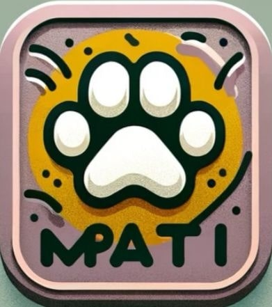

# MPATI: Pet Care Mobile Application

  

## Overview
**MPATI** is an innovative mobile application designed to connect pet owners with responsible pet caretakers in their local area. It aims to provide an affordable and trustworthy method of pet care when owners are away, addressing the high costs and concerns associated with traditional pet care methods.

## 🚀 Main features
- ✈️ Multi-platform: Android, iOS
- 🌙 Dark and light modes
- ⭐ Service establishing between Pet Owner and Pet Caretaker
- 💬 Chatting between Pet Owner and Pet Caretaker
- 📍 Location of Pet Caretakers shown in Map for the Pet Owners

## Report of Project
Link: https://docs.google.com/document/d/1oO6DFY0Svn1q_PVNlAkYC-plgo6nEXQS/edit?usp=sharing&ouid=103093154415576446732&rtpof=true&sd=true
